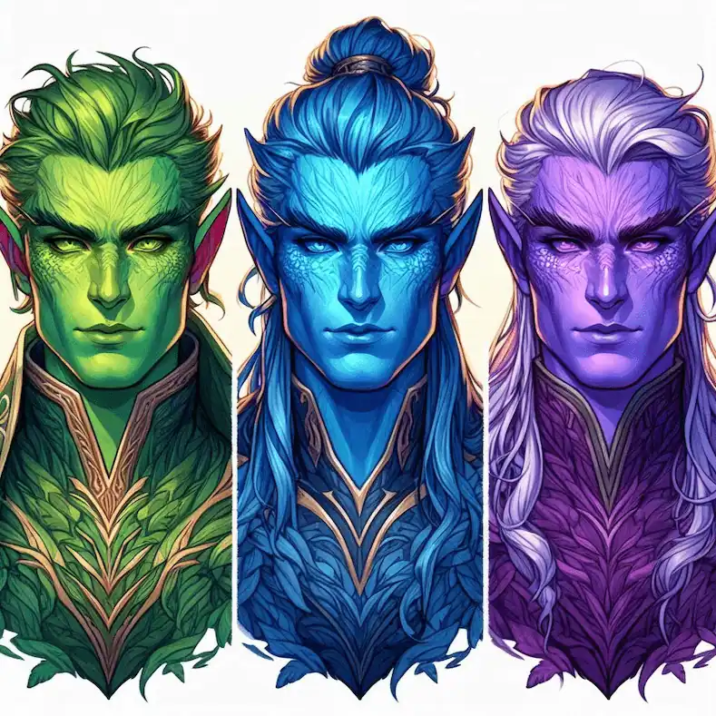
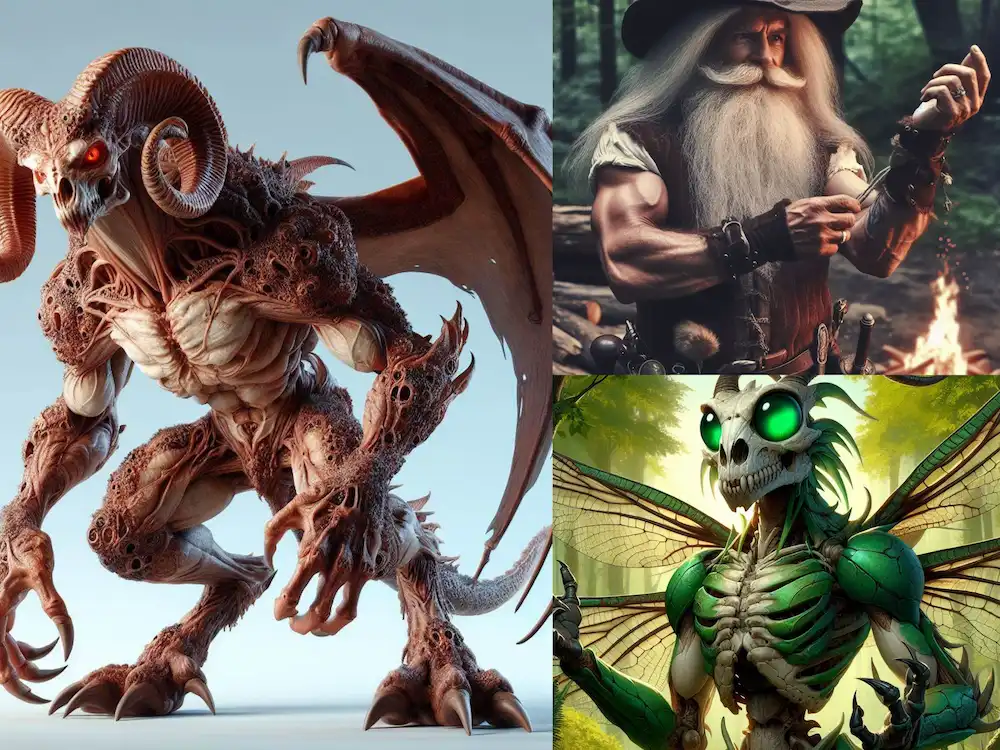

## <h1 class="text-4xl font-bold text-green-500">Las razas de Elessar</h1>
 

### <h2 class="text-2xl font-bold">Razas Alendi</h2>
 
<article class="flex flex-col md:flex-row items-center md:items-start">
    

        
    

    

        <h2 class="text-xl font-bold mb-2">Astrals, Icerals y Alabaía</h2>
        
Las razas alendi dominaron Elessar durante tres milenios. Son tres escisiones de la misma raza. Comparten longevidad y resistencia a enfermedades. Actualmente viven en sus respectivas regiones, más allá de Las Marcas.

    

</article>

 

#### <h2 class="text-2xl font-bold">Astrals</h2>

Fueron el pueblo alendi más grande, ocupaban los territorios de Mordelia, Luxia, la parte oriental de Gadonia y el norte de Valkaria. Son los más similares a la raza alendi original. Esbeltos y hermosos, de rasgos simétricos. Tienen los ojos verdes y la piel del mismo color, con un patrón oscuro que la recorre. Miden entre 2 y 2,5 metros de media, más altos que los humanos. Son más resistentes a las enfermedades y ágiles que los humanos, pero no tienen tanta fuerza. Tras la era de la conquista establecieron su territorio en el nuevo reino de Elenwel, tras Las Marcas de Mordelia.
 

#### <h2 class="text-2xl font-bold">Icerals</h2>

Alendi del norte. Necesitan vivir a temperaturas bajo cero para sobrevivir. Su piel es azul y sus ojos son cómo vibrantes orbes de color zafiro. Tienen el poder de manipular la temperatura a su alrededor, lo que les permite crear hielo de la nada. Esta habilidad, llamada hidrogenia, es considerada por muchos una especie de magia.
 

#### <h2 class="text-2xl font-bold">Alabaía</h2>

Su piel es de color púrpura, y se les distingue por tener los ojos completamente negros, sin traza de blanco. Son los alendi más fuertes. Tienen acceso a la dimensión oscura. De noche y generalmente bajo la luz de la luna (aunque los más antiguos pueden hacerlo a plena luz del día) se convierten a su forma noche, comúnmente conocida por los hombres cómo demoníacos.

Los demoníacos conservan la forma humanoide pero adquieren alas, cola, garras y cuernos similares a los de los Fulkeen, creando una especie de híbrido. También les crecen los colmillos y buscan la destrucción absoluta, pues, cuanto más jóvenes, mayor conciencia pierden al transformarse.
 

### <h2 class="text-2xl font-bold">Razas Oprimidas</h2>
 
<article class="flex flex-col-reverse md:flex-row-reverse items-center md:items-start">
    

        
    

    

        <h2 class="text-xl font-bold mb-2">Humanos, Fulkeen y Pek</h2>
        
Fueron aquellas razas dominadas por los alendi hasta la era de la conquista, cuando Arkanos, uniendo a humanos y fulkeen, revocó la hegemonía de los alendi y cambio el status quo de Elessar.

    

</article>

#### <h2 class="text-2xl font-bold">Humanos</h2>

Miden entre 1,60 y 2 m y son más fuertes que los astrals, por lo que fueron usados como mano de obra y esclavos durante siglos por los astrals. Tras la era de la conquista, se convirtieron en la raza hegemónica de Elessar, ocupando la mayor parte de los cuatro continentes, excepto los territorios más allá de las marcas.
 

#### <h2 class="text-2xl font-bold">Fulkeen</h2>

Se trata de seres descomunales (2-3m). Su cabeza se asemeja a la calavera de un carnero, con los ojos inyectados en sangre donde deberían estar las cuencas. Su idioma se basa en gruñidos y chirridos ya que su estructura del cráneo y la mandíbula no les permite hablar. Su torso, musculoso, está cubierto por unas placas de exoesqueleto, conocido cómo piel hueso. Sus brazos son musculosos y terminados en garras. Sus piernas son gruesas, con garras aún más enormes como pies. Tienen unas enormes alas similares a las de un murciélago en sus espaldas, que les permite volar. También tienen cola. Salvajes y despiadados por naturaleza, son similares a los pek ya que usan la conexión vital entre ellos a voluntad, por lo que no necesitan hablar. Aunque cuando se conectan con un humano, se vuelven más civilizados y la conexión es permanente, comparten un vínculo mental con el humano al que se conectan, adquieren mayor conciencia y otorgan al humano mejoras físicas y mentales. Los fulkeen más civilizados viven entre humanos, pero la gran parte vive en la zona prohibida, las tierras que Arkanos cedió a los fulkeen tras la era de la conquista.
 

#### <h2 class="text-2xl font-bold">Pek</h2>

Se trata de seres del tamaño de niños (1,20-1,50m) humanoides, su cabeza es similar a la de un fulkeen, con los ojos excesivamente grandes y verdes, con unas antenas en la cabeza. Tienen cuatro alas como libélulas. Su piel hueso es verde y viven en el bosque pek de Elgadan, donde decidieron retirarse voluntariamente tras la Era de la conquista. Con los siglos se volvieron seres míticos, los humanos los consideran hadas. De naturaleza pacífica y con el poder de la conexión vital a voluntad.
 

#### <h2 class="text-2xl font-bold">Mestizos</h2>

A pesar de que se supone que biológicamente los cruces entre razas alendi y humanos no son posibles. Existen rumores de criaturas nacidas de la unión de un alendi y un humano, que siempre adoptan el aspecto exterior de éstos últimos, pero con todo el poder y vigor de las razas alendi.
 