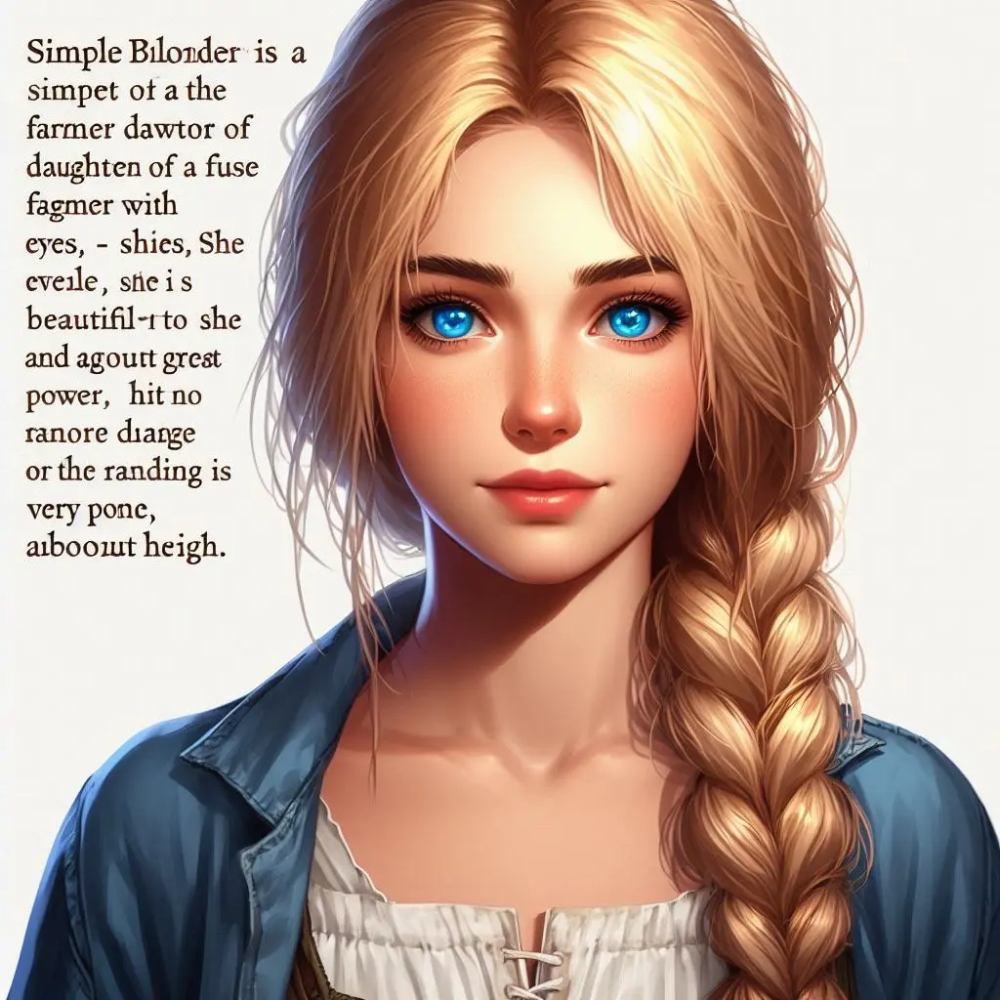
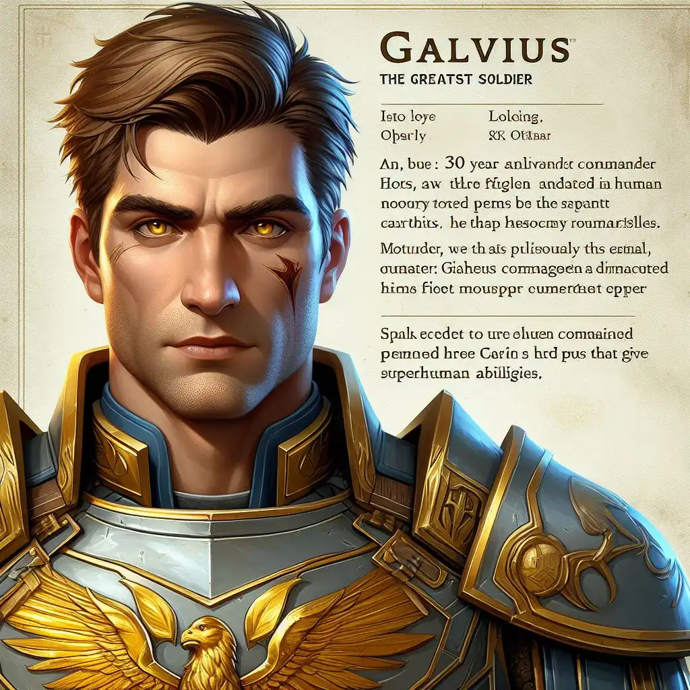
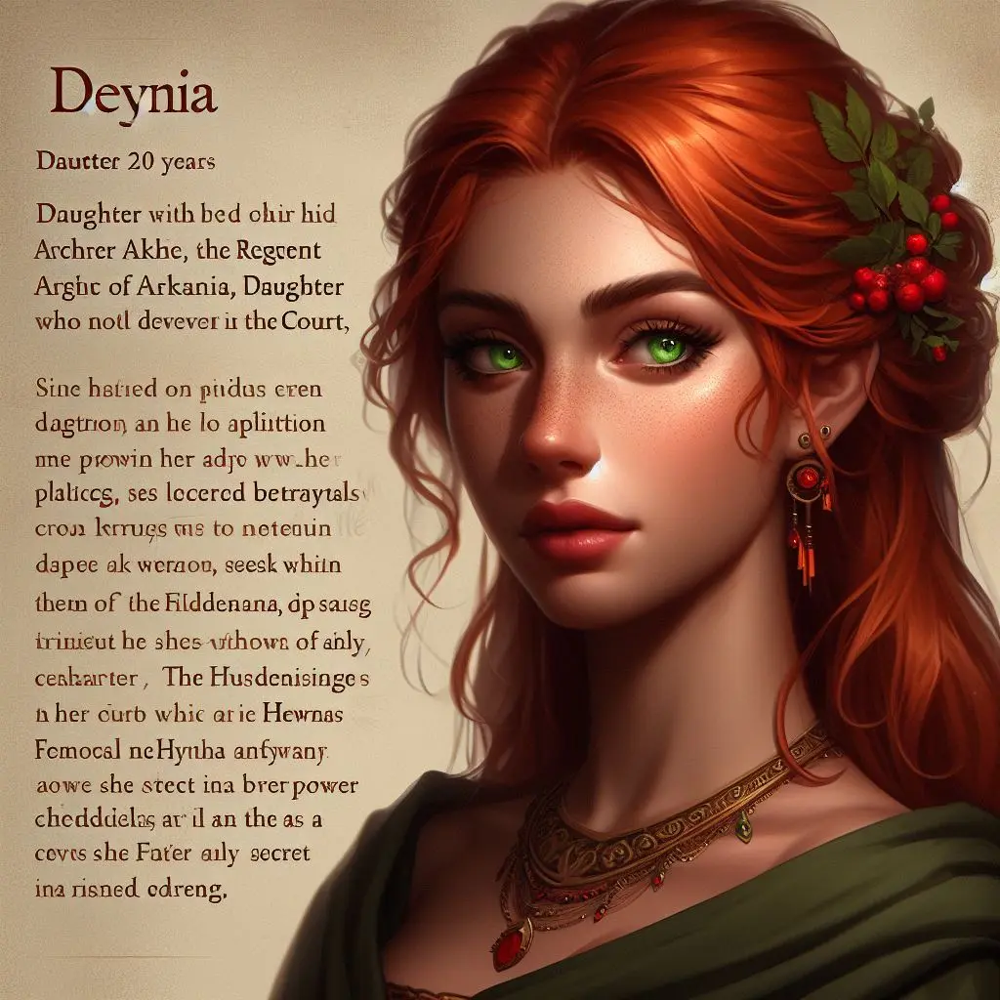
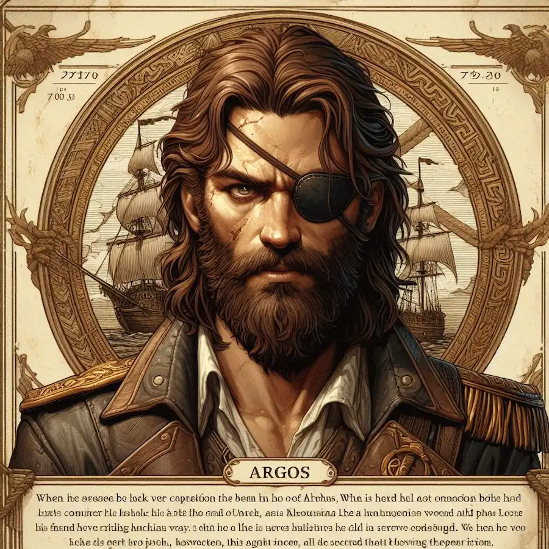
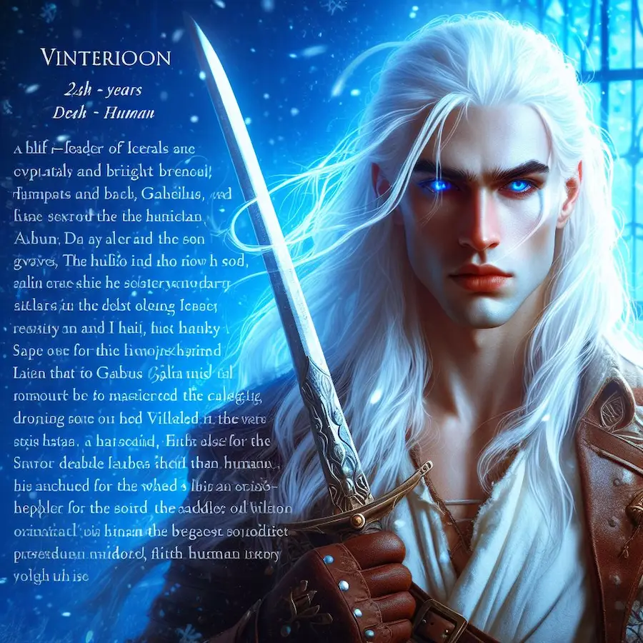

## <h1 class="text-4xl font-bold text-green-500">Los héroes de Elessar</h1>
 

Cinco personajes tienen la clave para resolver el misterior de Arkania ¿Quiénes son? ¡Conócelos aquí!
 

### <h2 class="text-2xl font-bold">Lilian Glyce</h2>
 
<article class="flex flex-col md:flex-row items-center md:items-start">
    

        
    

    

        
Lilian es la joven hija del alcalde de Nalas, un pequeño pueblo cerca de Las Marcas de Valkaria. A pesar de vivir tan cerca de los horrores de la guerra, los días pasan alegres en el pueblo. Pero ciertos eventos harán que Lilian descubra que muchas veces las cosas no son lo que aparentan.

    

</article>
 

### <h2 class="text-2xl font-bold">Galvius Direl</h2>
 
<article class="flex flex-col-reverse md:flex-row-reverse items-center md:items-start">
    

        
    

    

        
Galvius es el mayor héroe en toda la historia de la legión. Comandó durante décadas los ejércitos humanos. Ahora, retirado de su puesto por voluntad propia, se encarga de la protección del regente de los cuatro reinos, Archit Arker. Pero el hallazgo de una obra sobre su propia vida, escrita sin su consentimiento, hace que el soldado se embarque en una nueva aventura.

    

</article>
 

### <h2 class="text-2xl font-bold">Deyna Arker</h2>
 
<article class="flex flex-col md:flex-row items-center md:items-start">
    

        
    

    

        
Lady Arker es la hija del hombre más poderoso del mundo: el regente Archit Arker. Vive el día a día de la corte de Morwyn, dónde cuervos y serpientes se disputan las migajas del poder. El devenir de los acontecimientos harán que Deyna se dé cuenta de que su posición en la corte quizás no era tan robusta cómo ella creía.

    

</article>
 

### <h2 class="text-2xl font-bold">Argos, el azote de los mares del norte</h2>
 
<article class="flex flex-col-reverse md:flex-row-reverse items-center md:items-start">
    

        
    

    

        
Legendario capitán pirata, Argos perdió toda su tripulación en un naufragio años atrás. Ahora navega a las órdenes de otros, cruzando el océano buscándose a sí mismo. Tras un encuentro con un misterioso aventurero, se embarca en una nueva y peligrosa misión. Quizás así logre encontrar aquello que perdió.

    

</article>
 

### <h2 class="text-2xl font-bold">Vinterion</h2>
 
<article class="flex flex-col md:flex-row items-center md:items-start">
    

        
    

    

        
Hijo de un hombre humano y una mujer íceral, Vinterion es un mestizo. Una aberración de la naturaleza. Condenado a caminar entre dos mundos sin pertenecer a ninguno. En busca de la aceptación del pueblo íceral, se embarca en una misión con un único objetivo: matar a un dios.

    

</article>
 