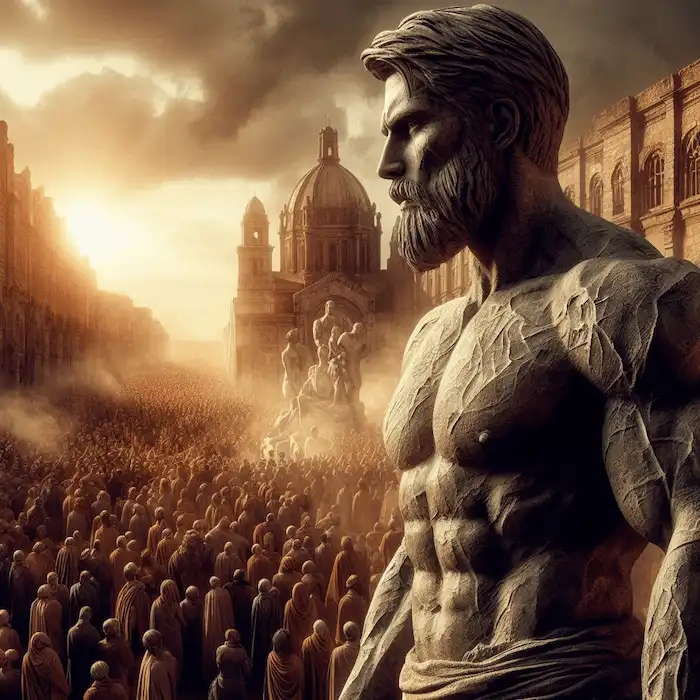
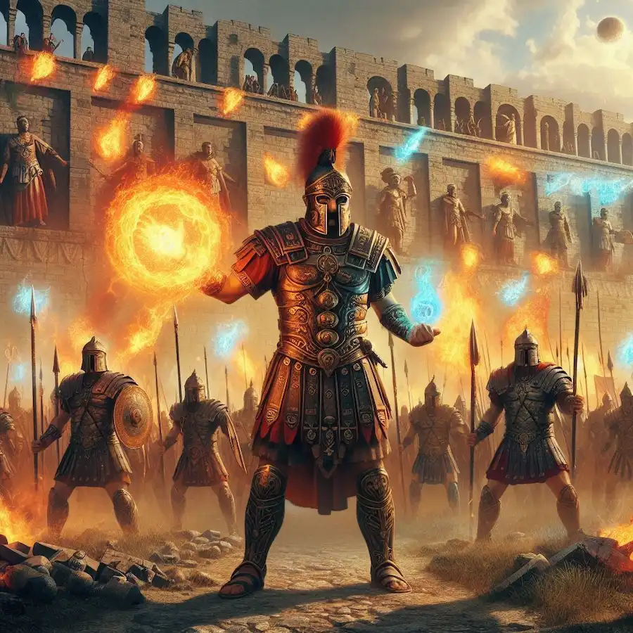

## <h1 class="text-4xl font-bold text-green-500">Sinopsis de Arkania</h1>
 

Todo esto está muy bien pero…  ¿De qué va Arkania?

 

Hace 600 años…

 

En el vasto mundo de Elessar, formado por cuatro grandes continentes, las razas alendi reinaban invictas. Humanos, fulkeen y pek servían como esclavos.

Todo cambió cuando Arkanos, el gran padre de los dioses, liberó a la humanidad. Desterró a las razas alendi a los remotos territorios más allá de Las Marcas. Aquella fue la Era de la Conquista.

Tras conquistar el mundo, Arkanos cayó petrificado a causa de una maldición. Sus últimas palabras cambiaron la historia:
 

<article class="flex flex-col md:flex-row items-center md:items-start">
    

        
    

    

        
Cuando Arkania sea descubierta, al fin podré regresar, y reinará la paz.

         
        
Arkanos, antes de la Sacra Petrificación.

    

</article>
 

Miles de aventureros han buscado Arkania, ese mítico lugar a lo largo de los siglos.

**Nadie lo ha encontrado.**
 

En la actualidad...

 

Cuatro reinos humanos dominan Elessar:
 
<ul className="list-disc list-inside pl-4 space-y-2">
    <li>**Valkaria** en el continente del sur.</li>
    <li>**Gadonia** en el continente del norte.</li>
    <li>**Luxia** en el continente del este.</li>
    <li>**Mordelia** en el continente central.</li>
</ul>
 

Liderados por los cuatro hijos de Arkanos, los dioses inmortales: Valkar, Gadon, Lucius y Mordeus. Conocidos como los celestiales, etéreos o tetrarcas.
 

<article class="flex flex-col-reverse md:flex-row-reverse items-center md:items-start">
    

        
    

    

        
Esta era de supremacía humana está marcada por las incesantes guerras en Las Marcas, enormes murallas que limitan los reinos de los humanos con los Ástral, Íceral y Alabaía. Las razas alendi tratan de recuperar sus territorios históricos, pero caen antre el gran ejército humano: la legión. Los legionarios de élite son capaces de utilizar las doce esencias para liberar sus poderes mágicos. Poderes que los alendi son incapaces de utilizar y que brinda a las huestes de la humanidad de un poder incomparable.

    

</article>
 

En este escenario de guerra y caos, cinco desconocidos están destinados a encontrarse. Y sin saberlo, cambiarán para siempre el destino de Elessar. Sus historias convergen en una novela río repleta de intriga, magia y acción.
 

**¿Lograrán encontrar Arkania y conseguir, al fin, una nueva era de paz duradera?**
